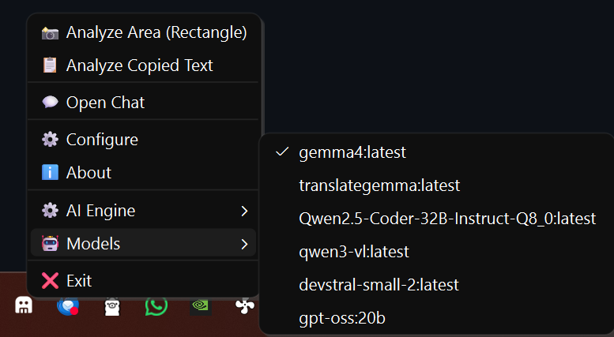

# 👁️ AI Assistant v3.4

[](https://github.com/zoott28354/ai_assistant/releases/tag/v3.4)
[](https://github.com/zoott28354/ai_assistant)
[](https://github.com/zoott28354/ai_assistant/blob/main/LICENSE)
[](https://github.com/zoott28354/ai_assistant)
[](https://github.com/zoott28354/ai_assistant)

AI Assistant is a local desktop companion for Windows built for real day-to-day use: capture part of the screen, read copied text, send prompts or images to your local models, and keep a persistent conversation history ready for follow-up.

The idea is simple: keep an assistant in the system tray that is always ready to translate, explain, analyze images, inspect on-screen errors, and continue the flow in chat without relying on the cloud.

## 🖼️ Screenshots

<table>
  <tr>
    <td align="center" width="50%">
      
      <br />
      <sub>Tray menu with backend and model selection</sub>
    </td>
    <td align="center" width="50%">
      
      <br />
      <sub>Main chat window with persistent sessions</sub>
    </td>
  </tr>
</table>

## ✨ Why use it

- 🔒 Everything stays local: screenshots, copied text, configuration, and chat history are stored on your machine.
- 🤖 Multiple local backends are supported: Ollama, LM Studio, Llama.cpp, Llama-Swap, and generic OpenAI-compatible endpoints.
- ⚡ Fast desktop-first workflow: start from the tray, analyze an area or copied text, then continue in chat.
- 🧠 Persistent sessions: conversations are stored in SQLite and can be resumed later.
- 🖥️ Updated v3.4 UI: improved webview-based chat, better sidebar, multilingual interface, and cleaner internal architecture.

## 🚀 What's new in v3.4

- 💬 New integrated desktop chat with modern webview rendering.
- 📚 Better session sidebar with search, rename, delete, and resizing support.
- 🗂️ More reliable session persistence and ordering based on latest activity.
- 🧭 Improved tray-first internal refactor without changing the current workflow.
- 📝 Updated prompts for copied text and image analysis.
- 📸 Native Windows snipping flow for `Analyze Area`.
- 🌈 Better practical behavior on HDR systems thanks to native screen capture.
- 🌍 Multilingual UI support for Italian, English, Spanish, French, German, and Portuguese.
- ℹ️ Multilingual Windows installer and multilingual `About` dialog in the tray menu.

## 🛠️ Main features

- 📸 `Analyze Area`
  Opens the native Windows snipping tool, captures the selection, and sends it to the active model.

- 📋 `Analyze Copied Text`
  Reads text from the clipboard and sends it directly for translation and analysis.

- 💬 `Persistent Chat`
  Continue an existing conversation or open a new one without losing context.

- 🔌 `Local Multi-Backend Support`
  Choose backend and model directly from the tray menu.

- ⚙️ `Persistent Backend Configuration`
  Backend URLs and interface language are saved in `config.json`.

- 🖼️ `Image Support`
  Image-based requests are handled by compatible multimodal backends.

## 🤖 Supported backends

The app is designed for local or self-hosted backends that expose models already available on your machine.

- Ollama
- LM Studio
- Llama.cpp
- Llama-Swap
- Generic OpenAI-compatible endpoints such as `vLLM` or `LocalAI`

Default values in [config.json](E:\AI_Assistant.claude\config.json):

- `Ollama`: `http://localhost:11434`
- `LM Studio`: `http://localhost:1234/v1`
- `Llama.cpp`: `http://localhost:8033/v1`
- `Llama-Swap`: `http://localhost:8080/v1`

You can change them directly from the interface without editing files manually.

## 📋 Requirements

### To use the Windows installer

- Windows 10 or Windows 11
- At least one supported local backend running if you want to actually use the assistant
- A GPU is recommended for smoother use with vision or multimodal models

Python is not required: the setup already includes the runtime needed to launch the app.

### To run the project from source

- Windows 10 or Windows 11
- Python 3.10 or newer installed on the system
- At least one supported local backend running
- A GPU is recommended for smoother use with vision or multimodal models

## 📦 Install from source

This section is only for people who want to clone the repository and run the project manually.

1. Clone or download the repository.
2. Run [setup.bat](E:\AI_Assistant.claude\setup.bat).
3. Wait for the virtual environment and dependencies to be installed.
4. Launch the app with `start_ai_assistant.bat`.

Manual setup:

```powershell
python -m venv venv
.\venv\Scripts\python.exe -m pip install --upgrade pip
.\venv\Scripts\python.exe -m pip install -r requirements.txt
.\venv\Scripts\pythonw.exe main.py
```

## 📚 Main dependencies

The Python dependencies are listed in [requirements.txt](E:\AI_Assistant.claude\requirements.txt):

- `pyqt6`
- `pyqt6-webengine`
- `ollama`
- `requests`
- `pyperclip`
- `pyautogui`
- `mss`
- `pillow`
- `markdown`
- `openai`

## 🧭 How it works

1. Launch the app.
2. Look for the icon in the system tray.
3. With a right click you can:
   - open the chat
   - choose backend and model
   - analyze an area of the screen
   - analyze copied text
   - open backend configuration
   - open the multilingual `About` dialog
4. After a capture or analysis, continue the conversation in chat for follow-up.

## 💾 Persistence and local files

The project stores local data in these files:

- [config.json](E:\AI_Assistant.claude\config.json): backend URLs and interface language
- [chat_history.db](E:\AI_Assistant.claude\chat_history.db): persistent chat history
- [history_db.json](E:\AI_Assistant.claude\history_db.json): legacy history file

When installed normally, user data is stored in `%AppData%\AI Assistant`.

If `portable mode` is selected during setup, data is stored next to the installed app instead.

During uninstall, the setup asks whether user data should also be removed.

## 🗂️ Repository structure

- [main.py](E:\AI_Assistant.claude\main.py): application bootstrap and orchestration
- [controllers](E:\AI_Assistant.claude\controllers): tray-first controller logic
- [core](E:\AI_Assistant.claude\core): configuration, i18n, backend helpers
- [services](E:\AI_Assistant.claude\services): sessions, tray, capture, clipboard
- [ui](E:\AI_Assistant.claude\ui): dialogs and UI helpers
- [workers](E:\AI_Assistant.claude\workers): background AI worker
- [installer.iss](E:\AI_Assistant.claude\installer.iss): Inno Setup installer script
- [build_installer.bat](E:\AI_Assistant.claude\build_installer.bat): local installer build helper
- [ai_assistant.ico](E:\AI_Assistant.claude\ai_assistant.ico): application icon
- [ui/about_dialog.py](E:\AI_Assistant.claude\ui\about_dialog.py): multilingual About dialog with clickable GitHub link

## 🧪 Technical notes

- The desktop shell is built with PyQt6.
- The v3.4 chat uses a `PyQt6-WebEngine` webview for a more flexible modern UI.
- Sessions are stored in SQLite.
- OpenAI-compatible local backends use the `openai` client with a custom `base_url`.
- Ollama uses the dedicated Python integration.
- `Analyze Area` relies on the native Windows snipping flow for better practical results, especially on HDR systems.

## ⬇️ Download

If you want a ready-to-use build:

1. Go to [Releases](https://github.com/zoott28354/ai_assistant/releases)
2. Download `AI_Assistant_Setup_v3.4.exe`
3. Install the app normally
4. If Windows SmartScreen appears, choose `More info` and then `Run anyway`

The setup already includes the runtime needed to launch the application, so Python does not need to be installed separately.

## 👤 Author

Created and maintained by `zoott28354`.

## 📄 License

This project is released under the MIT license.
See [LICENSE](E:\AI_Assistant.claude\LICENSE) for the full text.

## 📈 Project status

v3.4 is a more mature version than the previous releases, especially in:

- chat UI
- session management
- tray-first workflow stability
- native Windows capture integration
- multilingual interface and installer support

If you use local AI backends every day from the desktop, this version is aimed at being more reliable, more readable, and more comfortable in real use, not just in demos.
