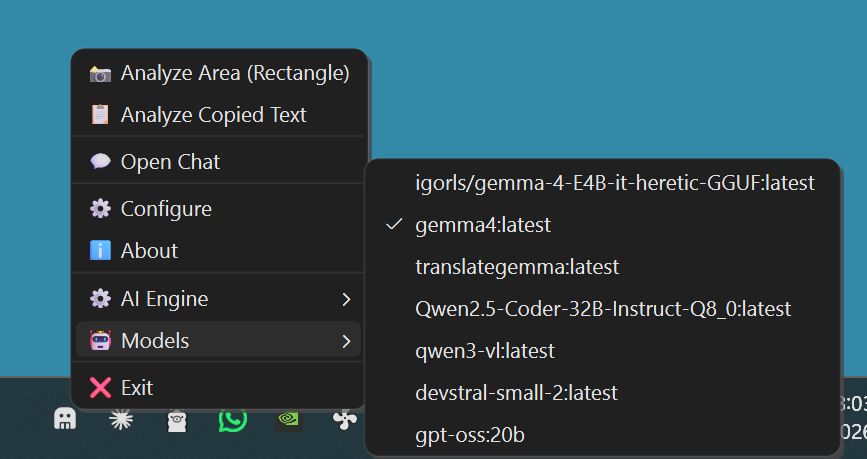
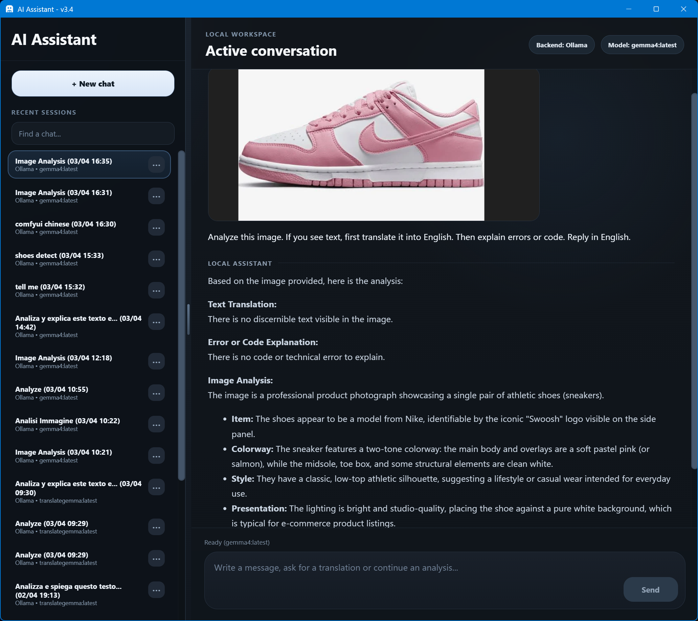

# 👁️ AI Assistant v3.5.1

[](https://github.com/zoott28354/ai_assistant/releases/tag/v3.5.1)
[](https://github.com/zoott28354/ai_assistant)
[](https://github.com/zoott28354/ai_assistant/blob/main/LICENSE)
[](https://github.com/zoott28354/ai_assistant)
[](https://github.com/zoott28354/ai_assistant)

AI Assistant is a local desktop companion for Windows built for real day-to-day use: capture part of the screen, read copied text, send prompts or images to your local models, and keep a persistent conversation history ready for follow-up.

The idea is simple: keep an assistant in the system tray that is always ready to translate, explain, analyze images, inspect on-screen errors, and continue the flow in chat without relying on the cloud.

## 🖼️ Screenshots

<table>
  <tr>
    <td align="center" width="50%">
      
      <br />
      <sub>Tray menu with backend and model selection</sub>
    </td>
    <td align="center" width="50%">
      
      <br />
      <sub>Main chat window with persistent sessions</sub>
    </td>
  </tr>
</table>

## ✨ Why use it

- 🔒 Everything stays local: screenshots, copied text, configuration, custom tray prompts, and chat history are stored on your machine.
- 🤖 Multiple local backends are supported: Ollama, LM Studio, Llama.cpp, Llama-Swap, and generic OpenAI-compatible endpoints.
- ⚡ Fast desktop-first workflow: start from the tray, analyze an area or copied text, then continue in chat.
- 🧠 Persistent sessions: conversations are stored in SQLite and can be resumed later.
- 🖥️ Updated v3.5.1 UI: improved webview-based chat, better sidebar, multilingual interface, and cleaner internal architecture.
- 📚 The sidebar supports search, rename, delete, and quick session access.
- 📤 Single chats can be exported as Obsidian-friendly ZIP archives or as cleaner PDF documents.
- 📎 The chat composer can attach images, documents, and PDFs for follow-up analysis.
- 🔎 Scanned PDFs can be rendered as page images and sent to compatible vision/OCR models.
- 🧹 A maintenance panel can compact the local SQLite history database and open the data folder.
- 🧩 Custom OpenAI-compatible endpoints can be named, so the tray and chat show friendly labels instead of generic slots.
- 🧭 The active tray model/backend is used when you continue an older chat, so resumed sessions follow your current tray selection.
- 📸 `Analyze Area` uses the native Windows snipping flow for better practical results, including HDR-friendly capture behavior.
- 🌍 The interface is available in Italian, English, Spanish, French, German, Portuguese, Russian, Japanese, and Simplified Chinese.
- ℹ️ The tray includes a multilingual `About` dialog, and the installer is multilingual too.

## 🛠️ Main features

- 📸 `Analyze Area`
  Opens the native Windows snipping tool, captures the selection, and sends it to the active model.

- 📋 `Analyze Copied Text`
  Reads text from the clipboard and sends it directly for translation and analysis.

- 💬 `Persistent Chat`
  Continue an existing conversation or open a new one without losing context. Chat messages can also be copied from the right-click context menu. The `+` button can attach images, text-like documents, DOCX files, and PDFs to a follow-up message.

- 📤 `Chat Export`
  Export an individual chat from the sidebar menu as a ZIP archive with Markdown, original image assets, and original attached documents, or as a standalone PDF.

- 🔌 `Local Multi-Backend Support`
  Choose backend and model directly from the tray menu. Custom OpenAI-compatible endpoints can be renamed so they are easier to recognize in the tray and in the chat header.

- ⚙️ `Persistent Backend Configuration`
  Backend URLs, interface language, and tray prompt templates are saved locally in the app configuration file.

- 🧹 `Local Maintenance`
  From `Configure`, open the local data folder or compact the SQLite database after deleting large chats or attachments.

- ✍️ `Custom Tray Prompts`
  You can customize the prompt used for `Analyze Copied Text` and `Analyze Area`, while keeping the built-in defaults if you prefer.

- 🧩 `Backend-managed Context`
  The app keeps and sends the conversation history, while context size and model parameters such as 32k, 65k, or 128k windows are managed by the selected backend and model configuration.

- 🖼️ `Image Support`
  Image-based requests are handled by compatible multimodal backends.

- 🔎 `PDF OCR Support`
  Text-based PDFs are read as text. Scanned PDFs are rendered into page images with PyMuPDF and sent to the active vision/OCR-capable model behind the scenes.

## 🧭 How it works

1. Download `AI_Assistant_Setup_v3.5.1.exe` from [Releases](https://github.com/zoott28354/ai_assistant/releases).
2. Install the app.
3. Launch it and look for the icon in the system tray.
4. With a right click you can:
   - open the chat
   - choose backend and model
   - analyze an area of the screen
   - analyze copied text
   - open backend configuration
   - open the multilingual `About` dialog
5. After a capture or analysis, continue the conversation in chat for follow-up.
6. In `Configure`, you can optionally customize the prompts used by tray actions.
7. In `Configure > Maintenance`, you can open the data folder or compact the local chat database.

## 🤖 Supported backends

The app is designed for local or self-hosted backends that expose models already available on your machine.

- Ollama
- LM Studio
- Llama.cpp
- Llama-Swap
- Generic OpenAI-compatible endpoints such as `vLLM` or `LocalAI`

- Default backend URLs:

- `Ollama`: `http://localhost:11434`
- `LM Studio`: `http://localhost:1234/v1`
- `Llama.cpp`: `http://localhost:8033/v1`
- `Llama-Swap`: `http://localhost:8080/v1`
- `Custom 1` / `Custom 2`: empty by default, for OpenAI-compatible LAN, VPN/Tailscale, self-hosted, or remote endpoints

You can change them directly from the interface without editing files manually. Custom endpoints also support an optional display name and API key.

Context length and generation parameters are handled by the backend you choose. For example, Ollama, LM Studio, Llama.cpp, Llama-Swap, vLLM, and LocalAI each expose their own settings for context windows, memory use, and model runtime behavior. AI Assistant preserves the chat history and sends it to the selected backend, but it does not override those backend limits.

## 🌐 Network and LAN FAQ

### Can I run the AI backend on another PC in my local network?

Yes. AI Assistant can connect to a backend running on another machine in the same LAN, as long as that backend listens on the network interface and the firewall allows the port.

Example LAN setup:

- PC A runs Ollama, LM Studio, Llama.cpp, or another compatible backend
- PC B runs AI Assistant
- AI Assistant is configured with the LAN IP address of PC A, such as `192.168.1.30`

### How should I configure Ollama over LAN?

If you want to replace the built-in `Ollama` backend with a remote Ollama server, use the native Ollama URL without `/v1`:

```text
Ollama: http://192.168.1.30:11434
```

On the PC running Ollama, make sure Ollama is listening on the network, not only on `localhost`. One common Windows setup is:

```powershell
setx OLLAMA_HOST "0.0.0.0:11434"
```

Then restart Ollama and allow the Windows Firewall prompt for port `11434`.

### Can I keep local Ollama and add a LAN Ollama as Custom 1?

Yes, and this is often the cleanest setup.

Keep the default local backend:

```text
Ollama: http://localhost:11434
```

Then configure `Custom 1` as an OpenAI-compatible LAN endpoint:

```text
Name: Ollama LAN
URL:  http://192.168.1.30:11434/v1
Key:  empty
```

The difference is intentional:

- `Ollama` uses Ollama's native API: `http://host:11434/api/chat`
- `Custom 1` / `Custom 2` use OpenAI-compatible APIs: `http://host:11434/v1/chat/completions`

### How do I test a LAN backend before using it in AI Assistant?

From the PC running AI Assistant, first test the port:

```powershell
Test-NetConnection 192.168.1.30 -Port 11434
```

For Ollama native models:

```powershell
curl.exe http://192.168.1.30:11434/api/tags
```

For OpenAI-compatible endpoints:

```powershell
curl.exe http://192.168.1.30:11434/v1/models
```

If the model list works but chat does not, check that the selected model name matches exactly, for example `gemma4:latest` instead of `gemma4`.

### What about LM Studio over LAN?

LM Studio can also work over LAN if its server is configured to listen on the network and Windows Firewall allows the port.

In AI Assistant, a LAN LM Studio endpoint usually looks like:

```text
LM Studio: http://192.168.1.30:1234/v1
```

If you prefer to keep the default local LM Studio entry unchanged, configure the remote one as `Custom 1` or `Custom 2` with a friendly name such as `LM Studio LAN`.

## 📋 Requirements

### To use the Windows installer

- Windows 10 or Windows 11
- At least one supported local backend running if you want to actually use the assistant
- A GPU is recommended for smoother use with vision or multimodal models

Python is not required: the setup already includes the runtime needed to launch the app.

### To run the project from source

- Windows 10 or Windows 11
- Python 3.10 or newer installed on the system
- At least one supported local backend running
- A GPU is recommended for smoother use with vision or multimodal models

## 📦 Install from source

This section is only for people who want to clone the repository and run the project manually.

1. Clone or download the repository.
2. Run [`setup.bat`](setup.bat).
3. Wait for the virtual environment and dependencies to be installed.
4. Launch the app with `start_ai_assistant.bat`.

The root `setup.bat` is the source setup entry point. Packaging files for the Windows installer are kept in the [`setup/`](setup) folder.

Manual setup:

```powershell
python -m venv venv
.\venv\Scripts\python.exe -m pip install --upgrade pip
.\venv\Scripts\python.exe -m pip install -r requirements.txt
.\venv\Scripts\pythonw.exe main.py
```

## 💾 Persistence and local files

AI Assistant stores its data locally on your machine.

- `config.json`: backend URLs, active backend/model selection, interface language, and custom tray prompt templates
- `chat_history.db`: persistent SQLite chat history, including image-based analysis sessions, original attached documents, and rendered PDF pages when OCR/vision fallback is needed

With a normal installation, user data is stored in `%AppData%\AI Assistant`.

If you enable `portable mode` during setup, data is stored next to the installed app instead.

During uninstall, the setup asks whether user data should also be removed.

If you delete large chats or PDF/image-heavy sessions, use `Configure > Maintenance > Compact database` to physically reclaim disk space. The same panel can open the local data folder in Explorer.

For advanced users running from source, the project files remain available in this repository, but the installer is designed so normal users do not need to understand the internal structure or Python dependencies.

## ⬇️ Download

If you want a ready-to-use build:

1. Go to [Releases](https://github.com/zoott28354/ai_assistant/releases)
2. Download `AI_Assistant_Setup_v3.5.1.exe`
3. Install the app normally
4. If Windows SmartScreen appears, choose `More info` and then `Run anyway`

The setup already includes the runtime needed to launch the application, so Python does not need to be installed separately.

## 👤 Author

Created and maintained by `zoott28354`.

## 📄 License

This project is released under the MIT license.
See [`LICENSE`](LICENSE) for the full text.

## 📈 Project status

v3.5.1 is a more mature version than the previous releases, especially in:

- chat UI
- session management
- tray-first workflow stability
- native Windows capture integration
- multilingual interface and installer support
- per-chat ZIP/PDF export
- custom tray prompts
- custom OpenAI-compatible endpoint naming
- chat attachments for images, documents, and PDFs
- scanned PDF OCR/vision fallback through rendered page images
- local database maintenance tools
- clearer model/backend behavior when resuming older chats

If you use local AI backends every day from the desktop, this version is aimed at being more reliable, more readable, and more comfortable in real use, not just in demos.

For version history, see [CHANGELOG.md](CHANGELOG.md).
